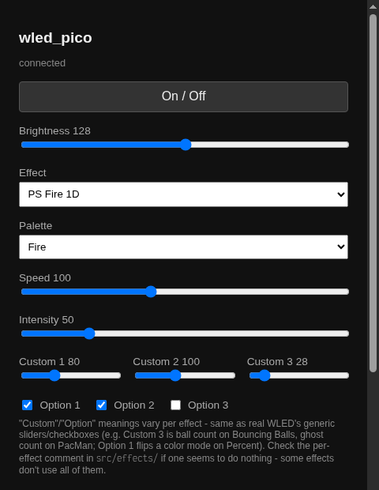
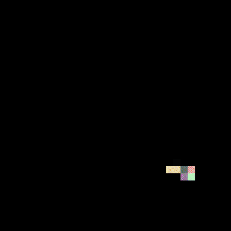
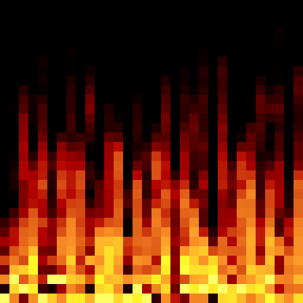
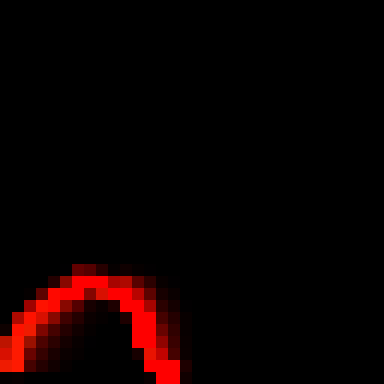
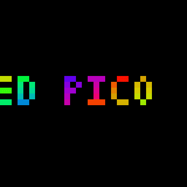
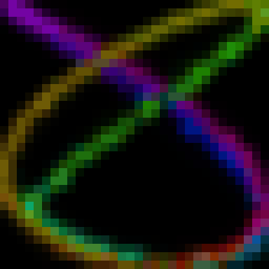
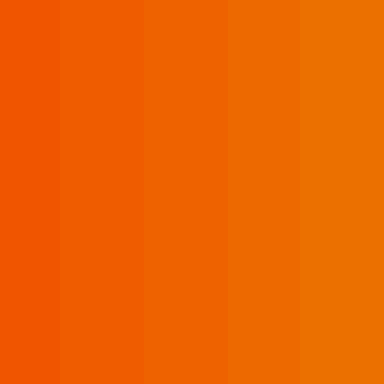
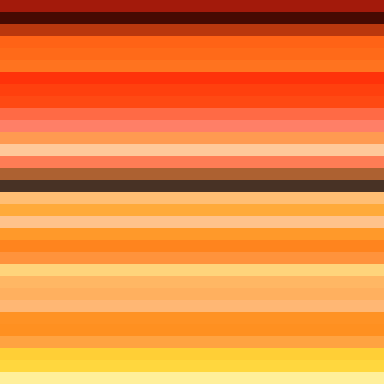

# wled_pico

> **This is a vibe-coded, AI-assisted translation of [WLED](https://github.com/wled/WLED)
> onto different hardware — not an official WLED project, not affiliated
> with or endorsed by WLED or its maintainers.** Nearly all of the effect
> math, the JSON API shape, and the palette data are WLED's own work
> (Copyright the WLED project and its contributors, primarily Christian
> Schwinne and Damian Schneider "DedeHai" for the effects/particle-system
> algorithms this ports — see individual source file headers and
> [Credits](#credits) below for exactly what came from where); what's new
> here is retargeting that onto an RP2040 driving a Pimoroni Cosmic
> Unicorn matrix, done almost entirely by Claude (Anthropic) acting on the
> repo owner's direction and review, not hand-written line-by-line. Bugs
> introduced in translation are this project's, not WLED's — see
> [LICENSE](./LICENSE) (EUPL v1.2, the same license WLED itself uses) for
> the full terms and copyright notices.

A WLED-*inspired* firmware for the Pimoroni Cosmic Unicorn (Pico W). Not a
literal port of [WLED](https://github.com/wled/WLED) — WLED's codebase
assumes an ESP8266/ESP32 + NeoPixelBus/FastLED stack that doesn't apply to
the Cosmic Unicorn's PIO-driven, row-multiplexed matrix. Instead this
reimplements WLED's *idea* (web UI, JSON API, effects engine) on top of a
purpose-built RP2040 display driver, reusing WLED's effect math and API
shape where that's architecture-agnostic.

**Note on hardware:** this project initially targeted the wrong Pimoroni
board (Galactic Unicorn, 53x11, one row-select address per row) when the
actual hardware is a Cosmic Unicorn (32x32, 1-in-2 row-multiplexed - 16
row-select addresses, each driving two physical rows at once). That
produced a real, visible bug: solid-color fills showed a localized block of
wrong colors on real hardware, traced to writing a 53x11-shaped bitstream
onto 32x32-shaped, differently-multiplexed silicon. The driver has since
been rebuilt against Cosmic Unicorn's actual geometry, pin/bitstream layout,
and PIO program - see Credits. Re-verified clean on hardware afterward.

## Screenshots

Every clip below is a real capture from the physical device, not a
simulation - pulled frame-by-frame from `GET /debug/frame` (a debug
endpoint that dumps the exact RGB buffer `effects::render()` last drew,
added specifically so effects could be verified by looking at them rather
than reading the code and assuming).

| | |
|---|---|
|  The control page (`src/net/captive_portal.cpp`) - real WLED `/json/state` shape underneath, no app required. |  **Fireworks 1D** (effect 90) - a flare climbs, bursts into sparks, fades out, repeats. |
|  **Fire 2012** - one of the 159 classic ported effects. |  **PS Volcano** - real WLED particle-physics engine, sub-pixel positions and gravity. |
|  **2D Scrolling Text** - the embedded Tom Thumb font rendering `seg[].n` live. |  **Lissajous** - a rotating curve, one of the two purely-mathematical (no audio, no hardware dependency) effects found still unported and added afterward. |
|  **Noise Pal** - Perlin noise driving a palette lookup, the other of those two. |  **PS Fire 1D** - a 1D particle simulation mapped onto the matrix as horizontal bands, matching real WLED's own default 1D-on-2D mapping exactly (not a bug - see `gen_particles_1d.cpp`). |

## Status

**All 5 milestones done and verified on hardware**, including a live,
network-driven OTA update and automatic WiFi reconnection on reboot.

| # | Milestone | Status |
|---|-----------|--------|
| 1 | Display driver bring-up | done — verified on (correct) hardware |
| 2 | WiFi AP + captive portal + static page | done — verified on (correct) hardware |
| 3 | Port 3-4 WLED effects onto the pixel buffer | done — verified on hardware |
| 4 | Real WLED `/json/state` API + minimal custom UI | done — verified on hardware |
| 5 | Presets, WebSocket live preview, OTA | done — verified on hardware |

Milestone 5 notes:

- **Presets** (`api/preset_store.cpp`, LittleFS-backed, `psave`/`ps`/`pdel`
  fields on `POST /json/state`) and **live WebSocket sync** (`/ws`, pushes
  state to every connected client on any change) are implemented.
- **WiFi station join** (`net/captive_portal.cpp`'s "Join WiFi" form,
  `POST /wifi`) - drops the device's own AP and joins an existing network,
  real WLED-style onboarding, then **persists the credentials to LittleFS
  and auto-rejoins on every future boot** (confirmed: triggered a reboot
  via OTA and it rejoined with zero manual intervention). A "Forget saved
  WiFi" button (`POST /wifi/forget`) reverts to AP-only permanently. The
  Pico W's CYW43 WiFi chip doesn't always complete a join promptly, and
  rarely just hangs outright - a hardware watchdog
  (`rp2040.wdt_begin(8000)`/`wdt_reset()` in `main.cpp`) recovers a hung
  join (silent reset back to AP-only) within ~8s instead of needing a
  physical BOOTSEL recovery; confirmed firing correctly on a real hang.
- **OTA** (`api/ota.cpp`, `POST /update`, multipart firmware.bin upload via
  arduino-pico's `Update` class) is confirmed working end to end -
  including catching a real bug: arduino-pico's OTA writes the incoming
  firmware into the **LittleFS partition itself** (not a separate flash
  slot), so `board_build.filesystem_size` has to be bigger than the
  firmware image, not just big enough for presets - it's 1MB now (see
  `platformio.ini`), not the 256KB it started at.

## WLED tool compatibility

Beyond the DIY control page, this firmware is discoverable and controllable
by real WLED tooling — the WLED mobile app, Home Assistant's WLED
integration, and WLED-protocol pixel-pusher tools — without needing to run
actual WLED firmware. Three pieces make that work, all added after
milestone 5 and all verified against wled/WLED's own source
(`wled00/json.cpp`, `wled00/wled.cpp`, `wled00/udp.cpp`) and against Home
Assistant's client library (`frenck/python-wled`), not guessed at:

- **mDNS discovery** (`main.cpp`'s `begin_mdns()`) — advertises `_wled._tcp`
  and `_http._tcp` with a `mac` TXT record, matching real WLED's own
  `wled.cpp` mDNS setup exactly. Re-armed (`MDNS.end()` + re-`begin()`) on
  every AP↔STA transition, since it's bound to whichever interface was up
  when it started and this device's AP can drop out from under it (see
  `net/captive_portal.h`'s join behavior).
- **JSON API correctness fixes** (`api/json_api.cpp`) — real WLED clients
  hit `/json/si`, `/json/eff`, `/json/pal` specifically (now registered
  alongside the more readable `/json/effects`/`/json/palettes` this
  firmware already had). More importantly, `/json/info`'s `ver` field used
  to be `"wled_pico-0.5"`, an unparseable non-semver string — Home
  Assistant's WLED integration parses `ver` and outright refuses to set up
  any device below a minimum supported version, so a firmware with a
  version string that fails to parse never got that far at all. It's now a
  real WLED release string (`"0.15.0"`) this firmware's JSON schema is
  actually compatible with. `/json/state` and `/json/info` also gained
  several fields (`nl`, `udpn`, `lor`, `mac`, `fs`, …) that aren't
  implemented behaviorally but are required *keys* client libraries expect
  to at least find present — their absence was a hard parse failure, not a
  missing feature.
- **UDP realtime pixel protocol** (`net/realtime_udp.h/.cpp`, port 21324) —
  WARLS/DRGB/DRGBW/DNRGB/DNRGBW, the wire format real WLED's own "send
  realtime data" feature and third-party pixel-pusher tools (screen-capture
  sync utilities, Hyperion-style ambilight setups) use to push live frames
  to a WLED device. Ported line-for-line from `wled00/udp.cpp`'s
  `handleNotifications()`. While active it bypasses `effects::render()`
  entirely and pushes the received frame straight to the display, same as
  real WLED's `realtimeMode` override — pixel id is row-major
  (`id = y*32+x`), matching WLED's own default 2D mapping. Out of scope,
  deliberately: the separate "wled notifier" protocol for syncing multiple
  WLED *controllers'* state together (this is always the only unit),
  TPM2.NET, and Art-Net/E1.31/DDP (different, heavier protocols).

## Effects library

178 of real WLED's 220 numbered effect IDs (0-219) are ported, each citing
the exact WLED source function/line it came from. Effect IDs match real
WLED's `FX_MODE_*` numbering exactly, not porting order — see `effects.h`'s
top comment. That's every hardware-feasible effect covered - of the 42
left out, 4 are real WLED's own reserved/retired "RSVD" slots (not real
effects even in upstream WLED) and the other 38 are **audio-reactive**
effects (including 9 that are also Particle System effects), out of scope
because this board has no microphone. Every remaining ID was individually
checked against real WLED's source for `getAudioData()`/FFT usage before
being written off as infeasible - three effects that looked unported
turned out to have no hardware dependency at all (Fireworks 1D, Noise Pal,
Lissajous) and were ported once found, rather than staying wrongly
lumped in with the audio-reactive set.

- **159 classic effects** (`src/effects/effects.cpp` plus
  `src/effects/gen_batch0.cpp`-`gen_batch8.cpp`), including the three found
  and ported afterward: Fireworks 1D, Noise Pal, and Lissajous.
- **22 Particle System effects** (`src/effects/gen_particles_2d.cpp` /
  `gen_particles_1d.cpp`, ids 187-217 — Volcano, Fire, Fireworks, Vortex,
  Fuzzy Noise, Ballpit, Box, Impact, Waterfall, Ghost Rider, Galaxy, and
  the 1D-strip ones DripDrop, Pinball, Dancing Shadows, Fireworks 1D,
  Sparkler, Hourglass, Spray 1D, 1D Balance, Chase, Starburst, Fire 1D),
  built on a faithful port of real WLED's actual particle-physics engine
  (`src/effects/particle_system_2d.h`/`.cpp`,
  `particle_system_1d.h`/`.cpp`) — sub-pixel positions, gravity, friction,
  per-axis wall bounce/wrap, particle-particle collisions with hardness,
  anti-aliased rendering, motion/smear blur, all ported from
  `wled00/FXparticleSystem.h`/`.cpp` rather than approximated. The 1D
  engine maps each particle's strip position onto its own full-width row
  (real WLED's own default 1D-onto-2D-matrix mapping,
  `Segment::setPixelColor()`'s `M12_pBar` case) rather than a single line,
  so multiple particles show as multiple independent horizontal bars, each
  bouncing on its own — not one shared line.
- **2D Scrolling Text** (`src/effects/gen_scrolltext.cpp`, id 122) — real
  WLED's own default font ("Tom Thumb", public domain, 3x6px,
  `src/effects/font_tom_thumb.h`) ported as a small embedded bitmap
  lookup, scrolling the text in `Params::name` (set via the control page
  or `seg[].n` over the API - real WLED dual-purposes its own segment name
  field as scroll text the same way). Deliberately narrower than real
  WLED's version: one font instead of its 5-font/.wbf-file-loading
  `FontManager`, no date/time token substitution (`#TIME`/`#DATE`/... -
  this firmware has no RTC/NTP time source), no rotation, no
  gradient/trail.

A full 72-palette engine (`src/effects/palettes.h`/`.cpp`) backs every
effect that keys off `SEGMENT.palette` in the original — all 59 built-in
WLED gradient palettes plus the 7 FastLED and 6 segment-color-derived
ones, ported from WLED's actual palette data (not approximated).

All 219 effect IDs (0-219, the 4 genuinely-retired "RSVD" ones included)
have been cycled live against real hardware over the JSON API with no
crashes, no watchdog resets, and stable free heap throughout (checked
again after the Particle System landed, not just once at the end of the
classic-effects push). That confirms memory/bounds safety across the
whole set, not that each one's visual output has been eyeballed
individually — a handful of upstream WLED quirks were found and
deliberately reproduced rather than "fixed" (see the per-effect comments
for specifics), so if one looks off compared to real WLED, check there
first before assuming a porting bug. Two real bugs *were* found and fixed
this way after initial porting: a `beatsin8()` phase-offset bug that broke
every effect using it to put multiple waves out of phase (see
`wled_compat.h`'s comment on it), and the 1D particle rendering mapping
described above.

## Hardware

[Cosmic Unicorn](https://shop.pimoroni.com/products/cosmic-unicorn) — Pico W
aboard, 32x32 RGB matrix, 1-in-2 row-multiplexed (16 physical row-select
addresses), driven through RP2040 PIO at ~300fps/14-bit.

## Building

Requires [PlatformIO](https://platformio.org/).

```
pio run                 # build
pio run -t upload       # flash (hold BOOTSEL, plug in, then run this)
pio device monitor       # serial console
```

The project uses [maxgerhardt's `platform-raspberrypi`
fork](https://github.com/maxgerhardt/platform-raspberrypi), which wraps
[earlephilhower/arduino-pico](https://github.com/earlephilhower/arduino-pico)
and adds Pico W support plus automatic `.pio` -> `.pio.h` compilation (see
`src/display/cosmic_unicorn.pio` — PlatformIO compiles it via a bundled
`pioasm` on every build, no manual step needed). Networking uses
`RPAsyncTCP`/`ESP32Async/ESPAsyncWebServer` as `lib_deps` — the RP2040 ports
of the same ESPAsyncTCP/ESPAsyncWebServer libraries WLED itself uses.

## Layout

```
platformio.ini
src/
  main.cpp                    wires display + effects + JsonApi + CaptivePortal together
  display/
    gu_pins.h                 board GPIO map
    cosmic_unicorn.pio        PIO program (bit-angle/BCD matrix scan-out)
    gu_display.h / .cpp       driver: begin() / set_pixel() / set_brightness()
  effects/
    effects.h / .cpp          effect engine core: Id enum, Params/State, Frame, self-registering dispatch
    wled_compat.h / .cpp      shared FastLED/WLED 8/16-bit math + PRNG helpers (random8, sin8, beatsin8, ...)
    palettes.h / .cpp         the 72-palette engine (color_from_palette)
    gen_batch0.cpp .. gen_batch8.cpp
                              152 more ported effects, one self-contained file per batch
    particle_system_2d.h / .cpp
                              real WLED's 2D particle-physics engine, ported
    particle_system_1d.h / .cpp
                              same, 1D (this board's 32-pixel matrix row)
    gen_particles_2d.cpp      11 2D Particle System effects built on the engine above
    gen_particles_1d.cpp      11 1D Particle System effects built on the engine above
    font_tom_thumb.h          embedded 3x6px bitmap font (real WLED's own default)
    gen_scrolltext.cpp        the "Scrolling Text" effect, built on the font above
    image_data.h / .cpp       backing store for the "Image" effect - up to 40 32x32 RGB frames
                              (animation included) the control page decodes in-browser via its own
                              from-scratch GIF87a/89a + LZW parser (no browser decode API dependency,
                              so it behaves identically everywhere) and uploads the raw frames
  net/
    captive_portal.h / .cpp   WiFi AP + wildcard DNS + the served control page
    device_id.h / .cpp        shared colon-free/lowercase MAC helper (mDNS TXT, /json/info)
    realtime_udp.h / .cpp     WLED-protocol UDP realtime pixel receiver (port 21324)
  api/
    json_api.h / .cpp         WLED-shaped /json/state, /json/info, /json/effects, /json/palettes
    preset_store.h / .cpp     LittleFS-backed presets.json (WLED preset shape, trimmed)
    ota.h / .cpp              POST /update - web-based firmware upload via arduino-pico's Update class
    image_upload.h / .cpp     POST /image - raw pixels for the "Image" effect (see image_data.h above)
```

## Credits

`gu_pins.h` and `cosmic_unicorn.pio` are vendored verbatim from
[pimoroni/pimoroni-pico](https://github.com/pimoroni/pimoroni-pico)
(MIT licensed) — the pin map and PIO program are board-specific and
hand-tuned; there was no reason to rederive them. `gu_display.cpp` is a
trimmed reimplementation of that repo's `cosmic_unicorn.cpp` (same
bitstream layout, row-doubling remap, and PIO/DMA setup, audio/synth
support removed, gamma table approximated rather than copied since we
didn't have Pimoroni's exact values — see the comment in `gu_display.cpp`
if displayed colors look off).

`effects/effects.cpp`'s original four effects are ported from specific
functions in [wled/WLED](https://github.com/wled/WLED)'s `wled00/FX.cpp`
(`mode_static`, `color_wipe`, `mode_rainbow_cycle`, `mode_breath`) and
`wled00/FX_fcn.cpp` (`Segment::color_wheel`, `color_blend`) — see the
per-function comments in that file for exact line references. The other
152 effects (`gen_batch0.cpp`-`gen_batch8.cpp`) and the full palette engine
(`palettes.cpp`) are ported the same way - each function/table cites its
exact WLED source location - see "Effects library" above for what's
deliberately not included and why.

`effects/particle_system_2d.h`/`.cpp` and `particle_system_1d.h`/`.cpp` are
ports of WLED's `wled00/FXparticleSystem.h`/`.cpp`, by Damian Schneider
("DedeHai") — the sub-pixel movement, gravity/friction/force, wall bounce/
wrap, particle-particle collision, and anti-aliased rendering math is
carried over faithfully; only the memory model changes (fixed static pools
sized for this board instead of WLED's runtime-sized shared-memory
slicing) and the white channel is dropped (this board's LEDs are plain
RGB). `gen_particles_2d.cpp`/`gen_particles_1d.cpp`'s 22 effects are
ported from `FX.cpp`'s `mode_particle*` functions the same way as every
other effect here.

`effects/font_tom_thumb.h` embeds real WLED's own default scrolling-text
font, "Tom Thumb" - public domain, by Robey Pointer
(https://robey.lag.net/2010/01/23/tiny-monospace-font.html), byte-for-byte
identical to `wled00/src/font/font_tom_thumb_6px.h`'s data (verified by
hand-decoding a glyph against that file's own worked example before
trusting it). `gen_scrolltext.cpp` ports the scrolling/layout logic from
`FX.cpp`'s `mode_2Dscrollingtext()`, not real WLED's much larger
`fontmanager.h`/`.cpp` (multi-font selection, `.wbf` file loading from
flash, glyph caching) - see "Effects library" above for exactly what's
narrower here.

`api/json_api.cpp`'s `/json/state` and `/json/info` field names and shapes
are matched against `wled00/json.cpp`'s `serializeState()`/
`deserializeSegment()`/`serializeInfo()`, trimmed to the single-segment
subset this firmware has state for (no presets, playlists, nightlight,
multi-segment, or palettes beyond a fixed "Default").

`net/realtime_udp.cpp`'s WARLS/DRGB/DRGBW/DNRGB/DNRGBW parsing is ported
directly from `wled00/udp.cpp`'s `handleNotifications()` (same header
bytes, same per-mode payload layout and loop bounds). The mDNS service/TXT
records `main.cpp`'s `begin_mdns()` registers match `wled00/wled.cpp`'s own
mDNS setup. See "WLED tool compatibility" above for what motivated both.
